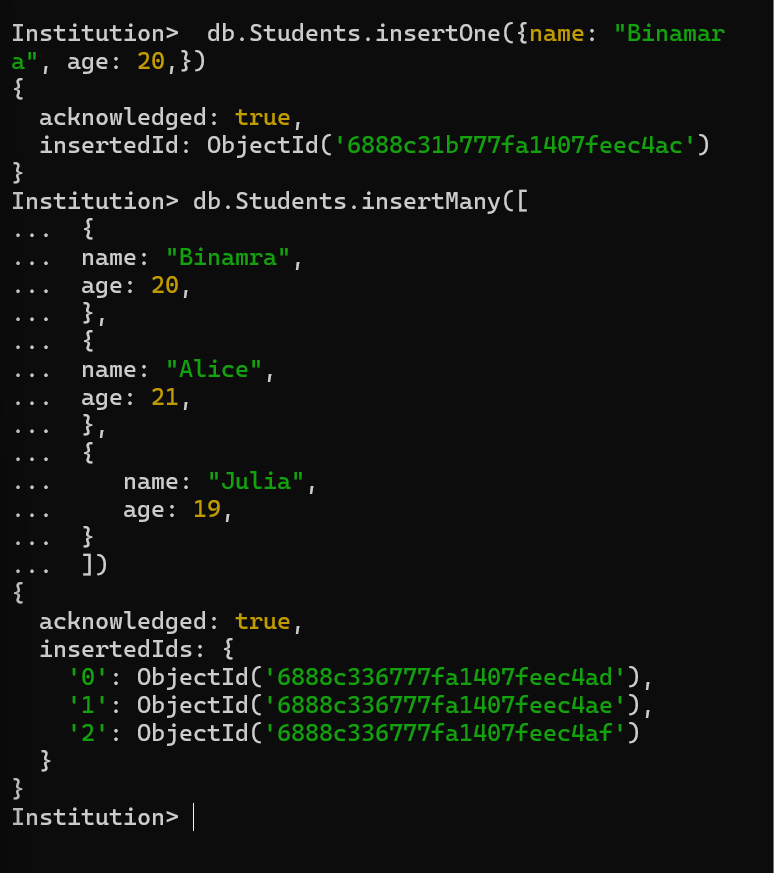

<h2>To create a document in a collection we can use the following syntax. There are two methods through which we can create a document:</h2>

<h3>Inserting only one Document</h3>

db.collection-name.insertOne({
 field1: value1,
 field2: value2,
 ...
 });

 
Example: db.Students.insertOne(
 {name: "Binamra",age: 20,})

 

<h3>Inserting many Document</h3>

 
db.collection-name.insertMany([
 { field1: value1, field2: value2, ... },
 { field1: value1, field2: value2, ... }, 
// ... 
]);

Example: db.Students.insertMany([
{name: "Binamra",age: 20,},
{name: "Alice",age: 21,},
{name: "Julia",age: 19,}
])

<h3>These are the commands used to execute the above operations</h3>

