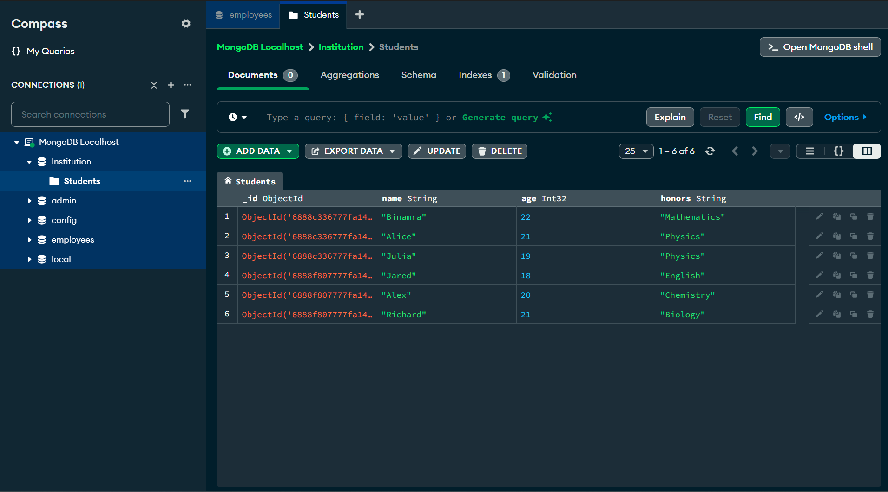
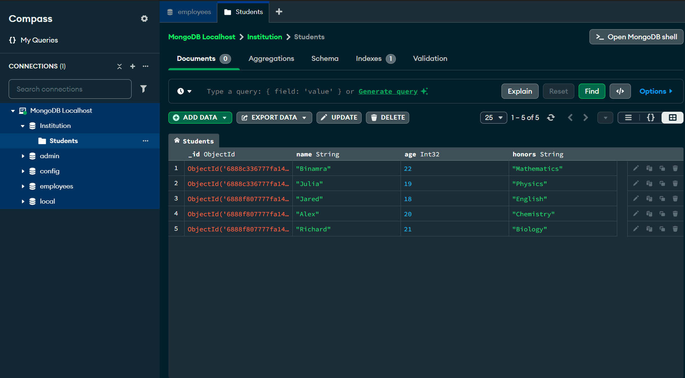
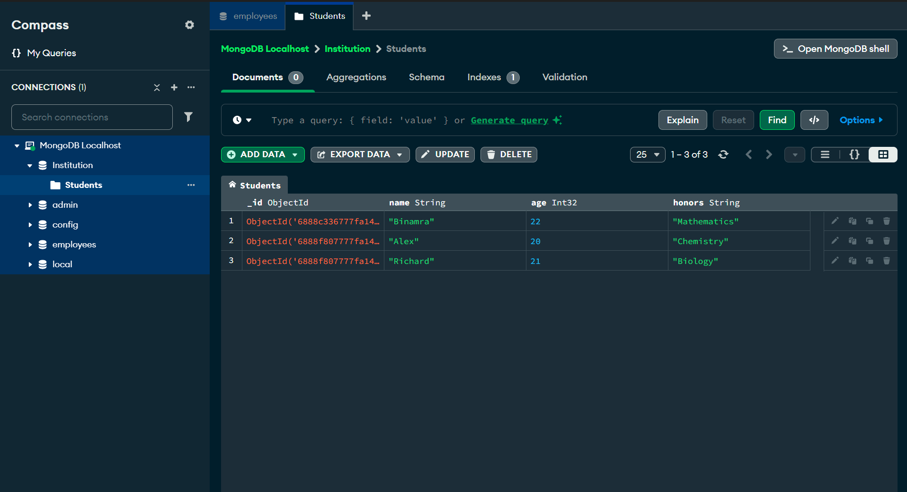
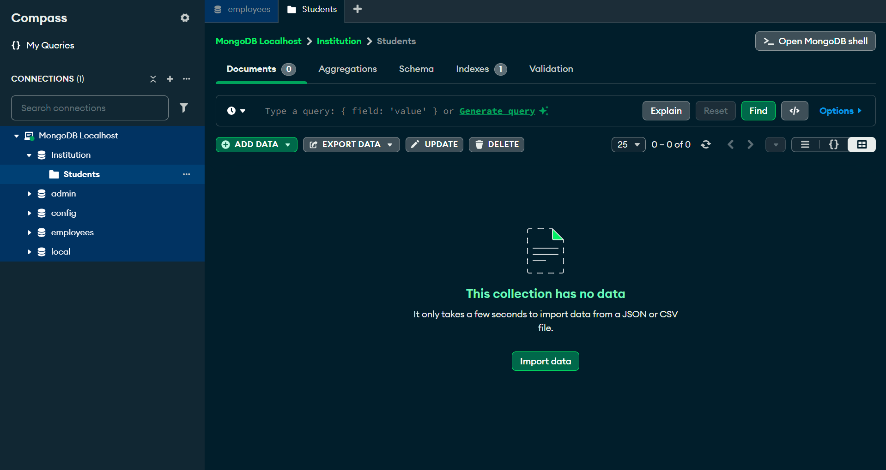
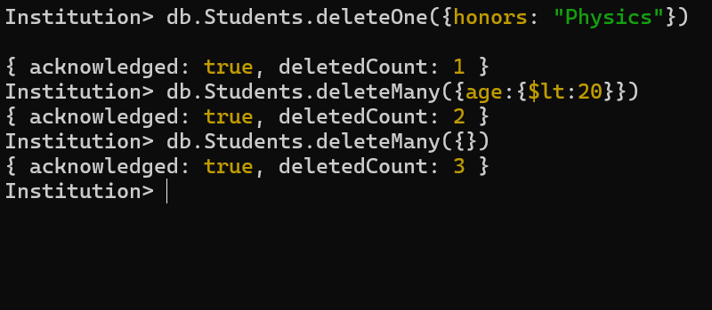

<h2>This is the initial view of the database</h2>

<h2>To delete the documents we use the following syntaxes: </h2>

<ul>
    <li>db.collectionName.deleteOne({ filter }) : deletes only one document based on the filter</li>
    
    <li>db.collectionName.deleteMany({ price: 55 }) : deletes all those document that matches the filter</li>
    
    <li>db.collectionName.deleteMany({}) : deletes all the documents in a collection</li>
    
</ul>

<h3>These are the following commands used for the above operations</h3>

