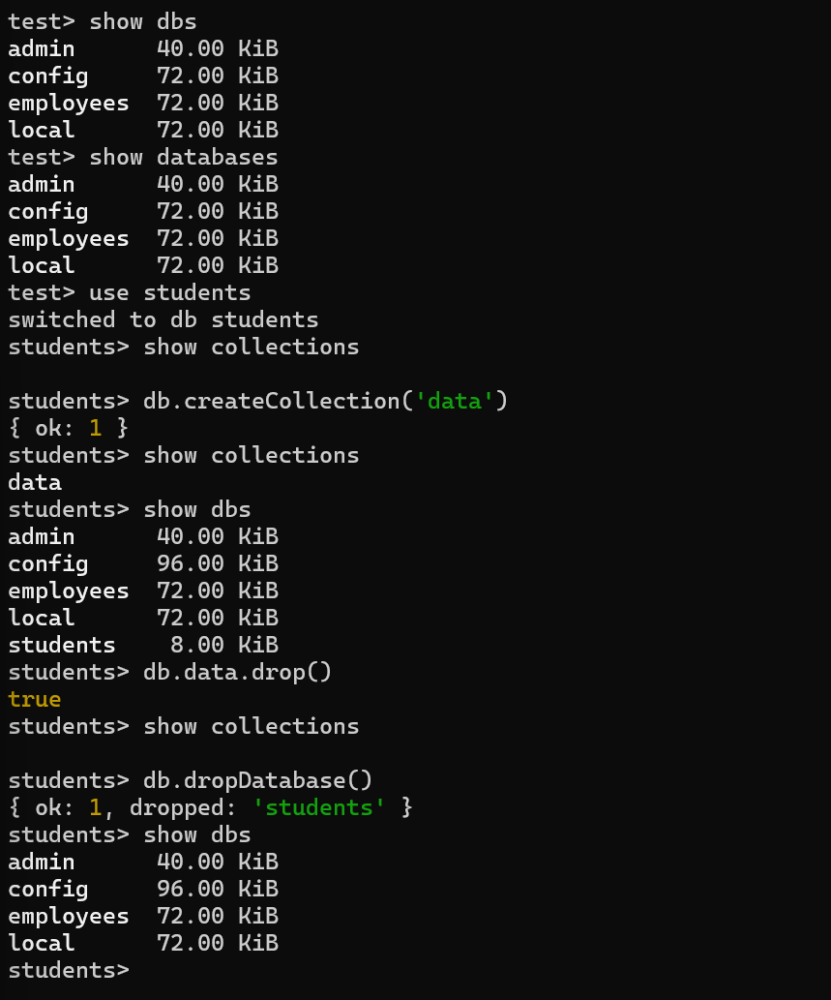

<h2>At first the MongoDB Community Sever and Mongo Shell was downloaded and basic operations were performed like:</h2>
<ul>
    <li>show dbs / show databases : to show all the databases created</li>
    <li>use database-name : to create a database</li>
    <li>db.dropDatabase() : to delete a database</li>
    <li>show collections : to show all collections created</li>
    <li>db.createCollection('collection-name’) : to create a collection in a database</li>
    <li>db.collection-name.drop() : to drop a collection </li>
</ul>

Important :- Unless and untill we create a collection in a created database the particular database is not created.

Following image represents the commands to show, create, delete databases & collections:

