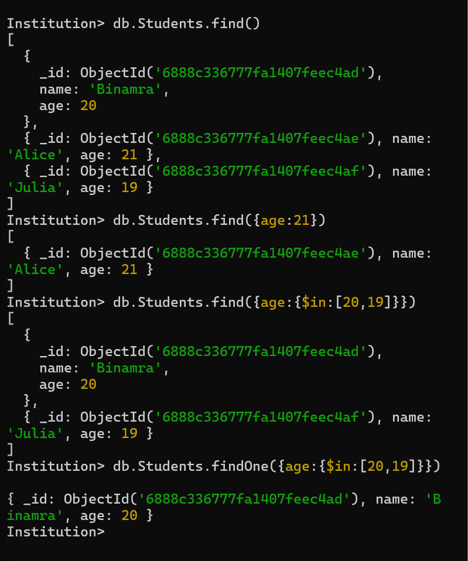

<h3>To read the created documents we can use the following commands:</h3>

<ul>
    <li>db.collection_name.find() : fetch all documents</li>
    <li>db.collection_name.find({ key: value }) : fetch documents based on equality condition</li>
    <li>db.collection_name.find( { field : { opeartor : [value_1,value_2,....]}}) : use of conditional operators</li>
    <li>db.collection_name.findOne({ key: value }) : gives only a single document not in the form of array</li>
</ul>

<h2>These are the following commands used for performing read operations</h2>

