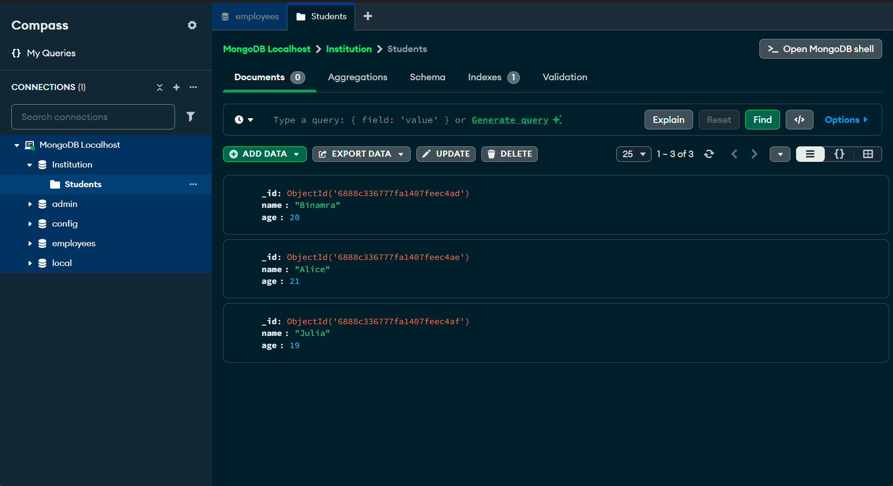
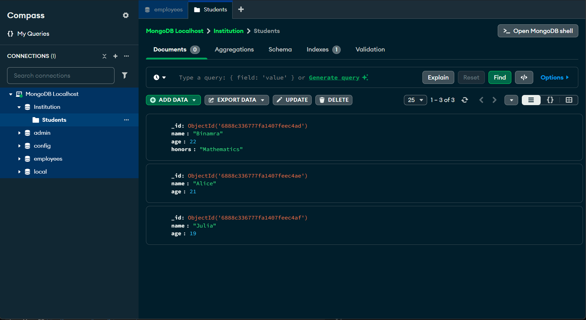
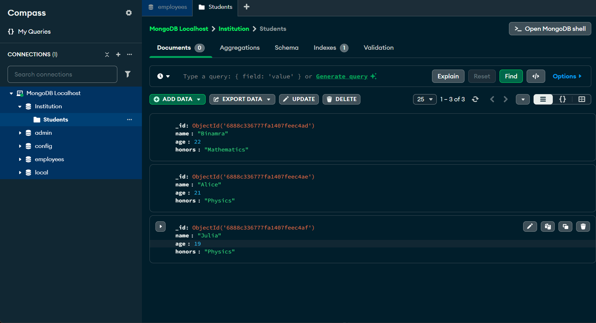
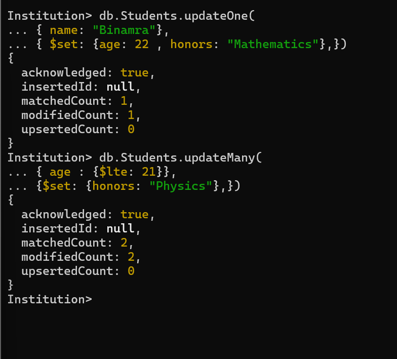

<h2>To update documents we follow the syntaxes like:</h2>

<h3>This is the initial view before performing the operations</h3>

<h3>Update One</h3>

db.collectionName.updateOne(
 { filter },
 { $set: { existingField: newValue, newField: "new value", // ... }, }
 );

 

 <h3>Update Many</h3>

 
db.collectionName.updateMany(
 { filter },
 { $set: { existingField: newValue, // ... }, }
 );

 

 <h3>Renaming a field</h3>

 
db.collectionName.updateOne(
 { filter },
 { $rename: { oldFieldName: "newFieldName" } }
 );

 <h3>These are the commands used for performing the above opeartions</h3>

 